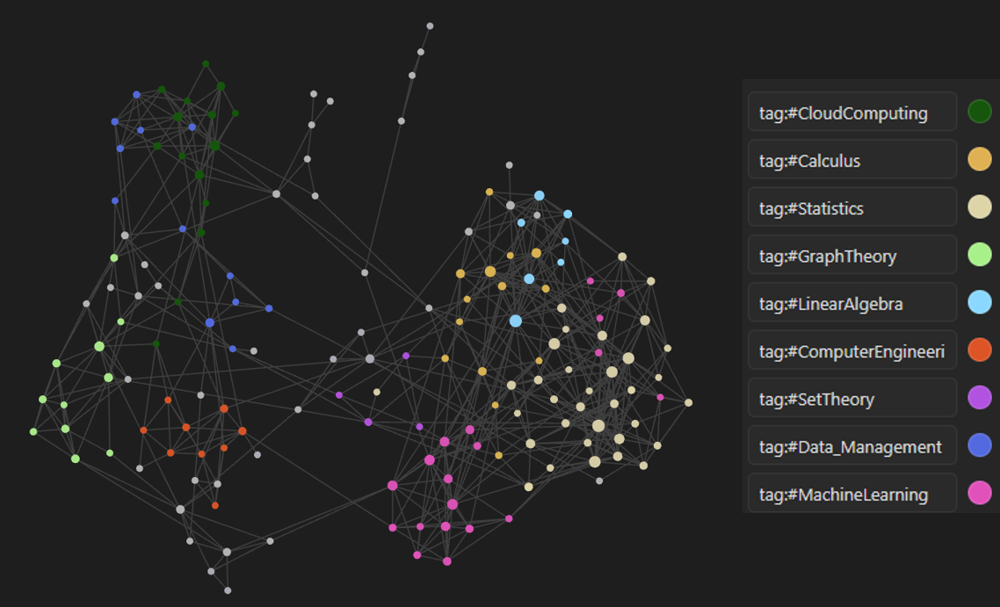

# DSTI Data Science & AI - Course Notes Vault

This repository contains my personal "Second Brain" developed during my 2-year Master’s program at **DSTI - School of Engineering**. It is built using **Obsidian**, a powerful knowledge management tool that allows for bi-directional linking between subjects.

The goal of this vault was to move away from isolated silos of information and instead visualize how foundational mathematics, software engineering, and advanced AI methods intersect.

## 📊 The Knowledge Graph

The image below represents the interconnected nature of the curriculum. You can see how **Applied Mathematics** and **Data Management** serve as the central hubs for more specialized clusters like **Deep Learning** and **MLOps**.



---

## 📂 Vault Structure

The vault is organized by core competencies, following the DSTI curriculum:

- **Mathematics & Theory:** Linear Algebra, Optimization, Statistics & Probability, Inverse Problems.
    
- **Engineering & Infrastructure:** Cloud Computing (AWS), Distributed Computing (Big Data), MLOps, Software Engineering.
    
- **Data Management:** SQL, NoSQL, Graph Databases, Semantic Web, and Data Wrangling (SAS).
    
- **Machine Learning & AI:** Neural Nets, Deep Learning (Transformers), Time-Series, and Agent-Based Modeling.
    
- **Professional Frameworks:** Ethics, Data Laws, and Project Management.
    

---

## 🚀 How to Use This Vault

To get the full experience (including the interactive graph and internal links), I recommend viewing these notes in **Obsidian**.

1. **Download Obsidian:** [Download here](https://www.google.com/search?q=https://obsidian.md/) (Free for personal use).
    
2. **Clone this Repo:** ```bash git clone https://www.google.com/search?q=https://github.com/Egjfour/dsti-course-notes.git
    
3. **Open as Vault:** Launch Obsidian, click "Open folder as vault," and select the cloned directory.
    
4. **Explore:** Use `Ctrl/Cmd + G` to open the Graph View and see how the notes connect.
    

_Note: These notes are a reflection of my personal learning journey. While I strive for accuracy, they are intended as a supplementary resource rather than an official textbook._

---

## 🛠️ Tech Stack

- **Note-taking:** [Obsidian](https://www.google.com/search?q=https://obsidian.md/)
    
- **Markup:** Markdown (CommonMark)
    
- **Mathematics:** LaTeX (rendered via MathJax in Obsidian)
    
- **Version Control:** Git
